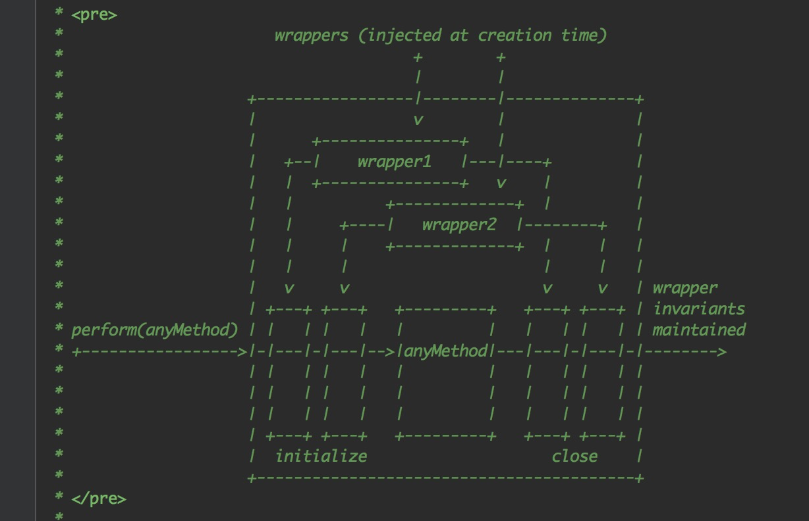

# batchedUpdates与事务

> 目前为止一些准备工作已经就绪，接下来我们将进入渲染阶段的处理。

文件依然是 `src/renderers/dom/client/ReactMount.js`，根据前一小节，我们可以知道根节点的DOMComponent 对象创建成功，接着会调用 `ReactUpdates.batchedUpdates` ，这是一个批量更新的方法，我们可以在源文件中进一步阅读。

```JavaScript
batchingStrategy.batchedUpdates(callback, a, b, c, d, e);
```

源文件中只不过是继续调用了一下另外一个 `batchedUpdates` 方法，这个方法你可以在 `src/renderers/shared/reconciler/ReactDefaultBatchingStrategy.js` 中阅读，整个代码量并不多，一个 `isBatchingUpdates` 布尔值变量以及一个 `batchedUpdates` 方法：

```JavaScript
var ReactDefaultBatchingStrategy = {
  isBatchingUpdates: false,
  batchedUpdates: function(callback, a, b, c, d, e) {
    var alreadyBatchingUpdates = ReactDefaultBatchingStrategy.isBatchingUpdates;
    ReactDefaultBatchingStrategy.isBatchingUpdates = true;
    if (alreadyBatchingUpdates) {
      callback(a, b, c, d, e);
    } else {
      transaction.perform(callback, null, a, b, c, d, e);
    }
  },
};
```

很明显初始化时的 `alreadyBatchingUpdates` 是一个 `false` ，于是我们进入了 `transaction.perform`，而这个callback则传入了定义在 `ReactMount.js` 中的 `batchedMountComponentIntoNode` 函数，恰好这个函数中也定义了一个 `transaction.perform` 传入的是 `mountComponentIntoNode` 函数，如果你从这跟进去之后你会发现真实的DOM节点是从 `ReactReconciler.mountComponent` 中return而来，它存储在node节点中，巧妙的是最后添加到浏览器中使用的是insertBefore，这说明React不是将DOM做为字符串处理的而是真实的 `document.createElement` 创建的DOM对象。

## Transaction

一路下来我们发现了很多 `transaction.perform` 的调用，那么它又是什么呢？



源码中的这张图很形象的说明了 `Transaction` 的作用，整个过程从perform开始会调用 `initialize` 方法，中间也许会处理很多其它方法，最后到调用close方法结束。对于 `React` 来说 `Transaction` 到底有什么作用呢？其实从初始化开始如何转化为真实的DOM元素这一个步骤中间，我们就能看到有非常多的 `transaction.perform` 的调用。

事务一般来说在数据库操作时非常常见，这个设计模式目标是在于并发访问多个构件之间共享的数据，它只是一个执行单元。那如果在 `React` 中，我们该如何理解这个设计呢？

## 理解React中的Transaction设计

待续 ...

