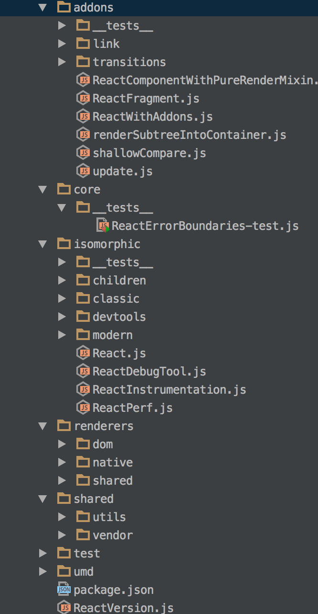

# 第一章：目录以及文件分析

> 混沌初开，从目录开始

先从下载源码开始吧 `git@github.com:facebook/react.git` ，然后找个编辑器去打开这个项目吧。第一眼，请不要被这个项目的目录结构吓坏了，其实你只需要阅读 `src` 目录就好。先从第一个文件 `ReactVersion.js` 开始，顾名思义它只有一个版本号的定义。

```JavaScript
'use strict';

module.exports = '15.1.0';
```

## React 是如何构建的

很不幸它使用了 `Grunt`，`Gulp`，`browserify` 以及 `npm scripts` 来构建 React，不过不要紧这些不是重点。如果，你有稍微看了一下 `React` 的源码，你应该对 `require('ReactComponent');` 会有印象，首先你需要理解它是如何构建的，不然的话如何查找到 `ReactComponent` 文件是一件非常痛苦的事情。 

SRC

```JavaScript
var ReactVersion = require('ReactVersion');
var onlyChild = require('onlyChild');
var warning = require('warning');
```

BUILD

```JavaScript
var ReactVersion = require('./ReactVersion');
var onlyChild = require('./onlyChild');
var warning = require('fbjs/lib/warning');
```

从这里，我想你应该可以看出差异，打开 `gulpfile.js` 文件搜索react:modules这个Task，在这个任务中FB解决了全局系统依赖的问题。`src` 目录下的源文件会被编译成扁平化的结构，这也意味着所有的文件都在同一级，所以你可以在 build 之后的文件中看到路径被转化成了相对路径。

如果你熟悉Node.js的话，你应该明白这些模块载入的规则，如果以 `/`，`./` 或者 `../` 开头的，这代表了文件路径。比如 `var ReactVersion = require('./ReactVersion');` 获取的是当前目录下的 `ReactVersion.js` 文件导出的模块。像`var warning = require('fbjs/lib/warning')` 如果不是系统模块，则从 `node_modules`中查询一直递归到根目录。

既然有名字，那么我去Github上搜索了一下fbjs是个啥玩意：[https://github.com/facebook/fbjs](https://github.com/facebook/fbjs)。

> A collection of utility libraries used by other Facebook JS projects.

好吧，它是一个工具函数集合，这样对于源码中的一些工具函数我们就可以找到出处了。

## 理解 SRC 目录

先看一下 `SRC` 目录的截图：



虽然目录看起来比较多但这都不是事，理解几个关键意思就好。`isomorphic` 目录基本上放置了你在日常编程中能使用到的东西，比如 `ReactComponet` 你在使用ES2015写组件时 `class Hello extends React.Component` 就是这个玩意。`renderers` 顾名思义这是关于如何渲染的逻辑都放置在这里，有两个版本分别是浏览器和Native。`shared` 属于共享类，大家都能用到的一些工具函数都放置在此。那么 `addons` 呢？ 从源码中能看到比如做简单动画时用到的 `ReactCSSTransitionGroup` 都放置在此。

## 从React.js文件开始

> path: src/isomorphic/React.js

在 `React.js` 源文件中出现了好几个全局的定义（就是没有使用require来载入的定义），比如 `__DEV__`，`Object.assign`，那么我们来看一看这些都是什么玩意。

BUILD

```JavaScript
var _assign = require('object-assign');
process.env.NODE_ENV !== 'production'

```

`Object.assign` 编译成了一个 `require('object-assign')` 模块，而 `__DEV__` 则成了 `process.env.NODE_ENV !== 'production'`，我想这个时候你应该会理解这些的意思了吧。

打开 `package.json` 文件搜索一下 `object-assign`，你可以看见它是从npm上下载的，于是你可以接着在Github上搜索一下：[object-assign](https://github.com/sindresorhus/object-assign)。

> ES2015 Object.assign() ponyfill

介绍中可以得知这是ES2015规范中的 `Object.assign`，如果你不知道这是干嘛的，请继续在MDN上搜索。

回到 `React.js` 源文件，我们可以看见它导出了一个 `React` 对象，在这个对象中就是我们日常编程所用到的那些。


