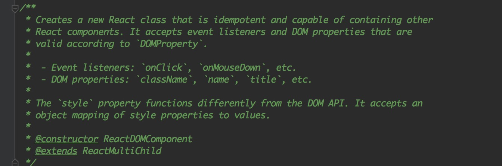

# ReactElement 对象如何转化成了 DOMComponent 对象

在上一小节中我们明白了如何创建ReactElement对象，并且知晓 `render` 方法开始执行的步骤，在这小节中我们将要寻找如何将ReactElement对象转化成了一个DOMComponent。



> src/renderers/dom/shared/ReactDOMComponent.js

当 render 的过程开始执行到 `_renderNewRootComponent` 时，在这个方法中除了batchedUpdates，还有非常重要的一步，那就是将之前ReactElement元素对象，传入 `instantiateReactComponent` 中来创建 DOMComponent 对象。

```JavaScript
var componentInstance = instantiateReactComponent(nextElement);
```

且来看一看 `instantiateReactComponent` 内部的逻辑，只粘贴 `node === object` 时并剔除掉 `invariant` ：

```JavaScript
var element = node;
if (typeof element.type === 'string') {
   instance = ReactNativeComponent.createInternalComponent(element);
} else if (isInternalComponentType(element.type)) {
   instance = new element.type(element);
} else {
   instance = new ReactCompositeComponentWrapper(element);
}
```

这个 `element` 就是 `ReactElement` 对象了，那么从这里开始一步一步我们可以追寻到 `ReactDOMComponent`，这才是真正创建 DOMComponent 对象的地方。不过，到了这一步，我们依然还无法在浏览器中查看。

当然如果你的 `element.type` 是一个 `function` 时，什么情况下 type 会是一个 function呢？比如：

```JavaScript
<Button type="primary" size="full">Full button</Button>
```
这个时候的 type 就是一个 function（React组件），于是它才会加上生命周期等。

`ReactDOMComponent` 是一个构造器，这构造器中并未有多复杂的地方，依然只是有了一些初始化的属性：

```JavaScript
function ReactDOMComponent(element) {
  var tag = element.type;
  validateDangerousTag(tag);
  this._currentElement = element;
  this._tag = tag.toLowerCase();
  this._namespaceURI = null;
  this._renderedChildren = null;
  this._previousStyle = null;
  this._previousStyleCopy = null;
  this._nativeNode = null;
  this._nativeParent = null;
  this._rootNodeID = null;
  this._domID = null;
  this._nativeContainerInfo = null;
  this._wrapperState = null;
  this._topLevelWrapper = null;
  this._flags = 0;
  if (__DEV__) {
    this._ancestorInfo = null;
    this._contentDebugID = null;
  }
}
```
并返回了这个 `ReactDOMComponent` 对象。


